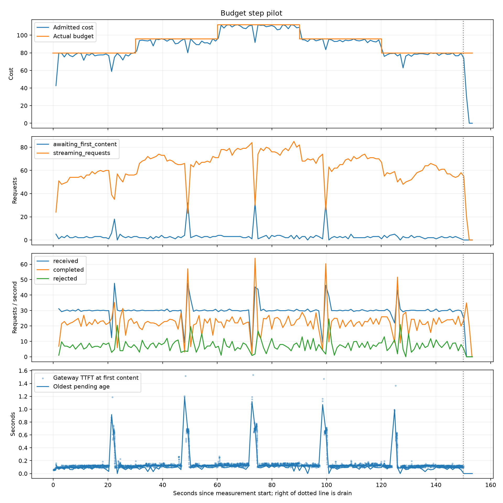

# vLLM Serving Benchmark Lab

A reproducible single-GPU LLM serving experiment built around **vLLM**, **Qwen3-4B-Instruct**, and an OpenAI-compatible FastAPI gateway.

The project started as a concurrency benchmark and evolved into an overload-control study:

> How should an inference gateway decide whether to admit a request when requests have very different prompt and output costs?

The final V1 design compares three policies under the same heterogeneous traffic:

1. **Baseline** — admit everything.
2. **Static protected** — bound request count with fixed in-flight and waiting limits.
3. **Token-cost-aware** — estimate request cost from prompt tokens and output cap, then admit only while total estimated work remains below a cost budget.

The final result is intentionally nuanced: token-cost-aware admission provides a controllable latency-vs-rejection frontier and strongly protects tail latency under overload, but this first-order linear cost model does **not** dominate a well-tuned static concurrency limiter at matched rejection/throughput.

---

## 1. Final Architecture

```text
Open-loop benchmark client
        |
        | streaming /v1/chat/completions
        v
+----------------------------------------------+
| FastAPI Admission Gateway :8080              |
|                                              |
|  ADMISSION_MODE=baseline                     |
|      -> pass through                         |
|                                              |
|  ADMISSION_MODE=protected                    |
|      -> MAX_IN_FLIGHT                        |
|      -> MAX_WAITING                          |
|      -> reject excess work with HTTP 503     |
|                                              |
|  ADMISSION_MODE=cost_aware                   |
|      -> apply Qwen chat template/tokenizer   |
|      -> estimate prompt tokens               |
|      -> estimate request cost                |
|      -> track current admitted cost          |
|      -> reject if budget would be exceeded   |
+----------------------------------------------+
        |
        | streaming proxy
        v
vLLM OpenAI-Compatible Server :8000
        |
        v
vLLM scheduler / continuous batching / KV cache
        |
        v
Qwen/Qwen3-4B-Instruct-2507
        |
        v
NVIDIA RTX 3090 24 GB
```

The gateway preserves streaming semantics. This is important because buffering the complete response in the proxy would invalidate client-observed **TTFT (time to first token)**.

---

## 2. Final V1 Environment

The final cost-aware validation and A/B/C comparison used:

- GPU: NVIDIA RTX 3090 24 GB
- Model: `Qwen/Qwen3-4B-Instruct-2507`
- vLLM: `0.30.0`
- PyTorch: `2.13.0+cu130`
- CUDA: `13.0`
- Python: `3.12.3`
- Max model length: `8192`
- Streaming: enabled
- Cloud environment: RunPod

Earlier phases were run while the project was evolving and used earlier vLLM/PyTorch builds. Final policy comparisons were rerun under one common environment so the A/B/C result is internally comparable.

Start vLLM:

```bash
vllm serve Qwen/Qwen3-4B-Instruct-2507 \
  --host 0.0.0.0 \
  --port 8000 \
  --max-model-len 8192
```

---

## 3. Experiment Roadmap

| Phase | Question | Main independent variable | Why it was needed | Main conclusion |
|---|---|---|---|---|
| 1. Concurrency | Does more concurrency improve throughput? | Max concurrency | Establish batching/latency tradeoff | Throughput rises strongly, but TTFT/TPOT also rise |
| 2. Sustained load | Where does steady-state overload begin? | Arrival RPS | Fixed request counts do not expose queue growth | Tail latency collapses before outright failure |
| 3. Static admission | Can bounded request count protect latency? | In-flight / waiting limits | Prevent unbounded backlog | 64/8 gave the best tested static tradeoff |
| 4. Heterogeneous traffic | Does one request equal one unit of work? | Request shape | Real traffic has different prompt/output sizes | Fixed request-count thresholds are workload-dependent |
| 5. Token calibration | How do input/output tokens affect service time? | Input tokens / output tokens | Separate request shape from queueing | Input and output length contribute differently |
| 6. Shape saturation | How much capacity does each shape consume? | Shape + RPS | Convert shape into system-level cost | Approximate capacity ratio ~1:2:3 |
| 7. V1 cost-aware admission | Can the gateway admit by estimated work instead of count? | Cost budget | Replace “one request = one slot” | Works as a controllable overload policy |
| 8. Final A/B/C | Does V1 beat baseline/static protection? | Admission policy | Validate the actual project hypothesis | Beats unprotected baseline under overload, but not static at matched rejection |

---

# 4. Phase 1 — Fixed-Concurrency Benchmark

## Reason

The first question was basic capacity characterization: how much throughput does vLLM gain from continuous batching as more requests are allowed to run concurrently?

## Controlled workload

- 100 requests per run
- 256 input tokens/request
- 128 output tokens/request
- Temperature 0
- EOS ignored
- Max concurrency: `1, 4, 8, 16, 32, 64`

## Results

| Concurrency | Output tok/s | Mean TTFT | P99 TTFT | Mean TPOT |
|---:|---:|---:|---:|---:|
| 1 | 81.96 | 61.24 ms | 72.37 ms | 11.81 ms |
| 4 | 320.89 | 56.25 ms | 269.52 ms | 12.11 ms |
| 8 | 591.95 | 72.90 ms | 286.27 ms | 12.55 ms |
| 16 | 984.53 | 123.45 ms | 356.27 ms | 13.92 ms |
| 32 | 1632.44 | 202.30 ms | 350.69 ms | 14.68 ms |
| 64 | 2665.72 | 345.10 ms | 454.55 ms | 16.71 ms |

## Conclusion

Concurrency from 1 to 64 increased output throughput by about **32.5x**, but scaling became increasingly sublinear and per-request latency rose.

GPU utilization reached 100% before throughput stopped increasing, so:

> **GPU utilization alone is not proof of inference-server saturation.**

This phase measured batching behavior, not steady-state overload.

---

# 5. Phase 2 — Open-Loop Sustained Load

## Reason

A fixed number of requests cannot reveal what happens when new work keeps arriving faster than the server can finish it.

The benchmark was changed to **open-loop arrival scheduling**:

```text
arrival interval = 1 / target RPS
```

Request completion does not slow future arrivals, allowing queue growth and overload to emerge naturally.

## Metrics

`sustained_load.py` records:

- success / rejection / failure counts
- scheduling lag
- P50 / P95 / P99 TTFT
- P50 / P99 end-to-end latency
- realized prompt/output tokens

## Representative fixed-workload result

| RPS | P99 TTFT | P99 E2E |
|---:|---:|---:|
| 10 | 0.236 s | 2.004 s |
| 12 | 0.283 s | 2.158 s |
| 15 | 1.077 s | 3.262 s |
| 20 | 1.549 s | 4.383 s |
| 30 | 13.449 s | 18.772 s |

## Conclusion

Tail latency degraded sharply before request failures became common. At 30 RPS the server still accepted almost everything, but queueing made the service effectively unusable.

This motivated explicit admission control.

---

# 6. Phase 3 — Static Request-Count Admission

## Architecture difference

Protected mode adds two fixed limits:

```text
MAX_IN_FLIGHT
MAX_WAITING
```

If the gateway cannot admit more work, it returns HTTP `503` rather than allowing backlog to grow without bound.

Tested configurations:

```text
32 in-flight / 8 waiting
48 in-flight / 8 waiting
64 in-flight / 8 waiting
```

## Result

`64/8` was the best tested static configuration.

Historical severe-overload comparison at 30 RPS:

| Metric | Baseline | Static 64/8 |
|---|---:|---:|
| Reject rate | 0% | 36.9% |
| P99 TTFT | 13.449 s | 3.037 s |
| P99 E2E | 18.772 s | 5.195 s |

## Conclusion

Admission control does not make the GPU faster. It prevents unlimited queue growth by deliberately trading some availability for bounded latency.

However, this policy still assumes:

> **one request = one unit of capacity**

That assumption became the next problem.

---

# 7. Phase 4 — Heterogeneous Traffic

## Reason

Production inference requests do not have identical prompt/output lengths.

The deterministic benchmark cycles through:

```text
short_interactive -> medium -> long_context -> long_output -> repeat
```

Current workload definitions:

| Workload | Prompt characteristic | max_tokens |
|---|---|---:|
| short_interactive | short prompt | 64 |
| medium | repeated medium prompt | 128 |
| long_context | long repeated prompt | 128 |
| long_output | short prompt | 512 |

This isolates two important forms of work:

- **prefill pressure** from long prompts
- **decode pressure** from long generated outputs

## Key result

A fixed `64/8` policy behaved well at one mixed-load operating point and less well at another.

Historical mixed-workload examples:

| Policy / Load | Reject | P99 TTFT | P99 E2E |
|---|---:|---:|---:|
| Static 4/2 @ 25 RPS | 86.8% | 1.642 s | 3.001 s |
| Static 64/8 @ 25 RPS | 0% | 0.412 s | 3.305 s |
| Static 64/8 @ 30 RPS | 11.0% | 1.976 s | 4.284 s |

## Conclusion

A low request-count cap can reject too much and reduce batching efficiency. A larger cap can work well under one mix/load and poorly under another.

> **Static request-count admission is workload- and load-dependent.**

Detailed Phase 4 notes:

[experiments/heterogeneous-workload-2026-09-23.md](experiments/heterogeneous-workload-2026-09-23.md)

---

# 8. Phase 5 — Token-Cost Calibration

## Reason

The gateway needed a better representation of “how expensive is this request?”

Low-load calibration separated request shape from queueing:

```text
Load = f(arrival rate, input tokens, output tokens)
```

### Input sweep

Output stayed near 128 tokens while realized input grew from 32 to 1,418 tokens.

P50 TTFT increased approximately:

```text
68.8 ms -> 76.1 ms
```

### Output sweep

Input stayed near 98 tokens while output was forced to:

```text
32, 128, 256, 512, 1024
```

P50 E2E increased approximately:

```text
0.418 s -> 13.972 s
```

## Conclusion

Input and output token counts both matter, but low-load latency slopes are **not** sufficient admission weights because vLLM batching changes system behavior under load.

Detailed calibration:

[experiments/token-cost-calibration-2026-10-04.md](experiments/token-cost-calibration-2026-10-04.md)

---

# 9. Phase 6 — Workload-Shape Saturation

## Reason

Instead of deriving request cost from isolated latency alone, the next experiment measured how much sustainable arrival capacity each request shape consumed.

Three fixed shapes were driven toward saturation:

| Shape | Realized input | Realized output |
|---|---:|---:|
| Baseline | 98 | 128 |
| Prefill-heavy | 1,418 | 128 |
| Decode-heavy | 98 | 512 |

Each point was repeated three times and medians were used.

## Saturation results

### Baseline

| RPS | P99 TTFT | P99 E2E |
|---:|---:|---:|
| 10 | 0.126 s | 1.847 s |
| 15 | 0.217 s | 2.081 s |
| 20 | 0.740 s | 2.832 s |
| 25 | 1.747 s | 5.477 s |
| 30 | 2.855 s | 6.907 s |
| 35 | 4.612 s | 11.745 s |

Healthy region: roughly **20 RPS**.

### Prefill-heavy

| RPS | P99 TTFT | P99 E2E |
|---:|---:|---:|
| 5 | 0.150 s | 2.164 s |
| 8 | 0.154 s | 2.598 s |
| 10 | 0.197 s | 5.048 s |
| 12 | 0.903 s | 19.821 s |
| 15 | 18.093 s | 34.847 s |
| 20 | 30.029 s | 42.659 s |

Healthy region: roughly **10 RPS**.

### Decode-heavy

| RPS | P99 TTFT | P99 E2E |
|---:|---:|---:|
| 5 | 0.115 s | 9.247 s |
| 8 | 0.440 s | 18.046 s |
| 10 | 0.426 s | 26.759 s |
| 12 | 11.608 s | 34.137 s |
| 15 | 23.189 s | 44.665 s |
| 20 | 39.353 s | 58.229 s |

Practical healthy region: roughly **5–8 RPS**.

## Capacity-derived cost intuition

Using baseline capacity as normalized cost 1:

```text
baseline       ~20 RPS -> ~1x
prefill-heavy  ~10 RPS -> ~2x
decode-heavy   ~5-8 RPS -> ~2.5-4x
```

A convenient V1 approximation is:

```text
baseline : prefill-heavy : decode-heavy ~= 1 : 2 : 3
```

This is an empirical serving-capacity approximation, not a universal physical law.

---

# 10. Phase 7 — V1 Token-Cost-Aware Admission

## Cost model

The gateway uses:

```text
C(I, O) = c + alpha * I + beta * O
```

where:

- `I` = estimated prompt tokens before admission
- `O` = requested `max_tokens`
- actual output tokens are unavailable before the request runs, so V1 uses the output cap conservatively

The three calibration anchors are:

```text
C(98, 128)   ~= 1
C(1418, 128) ~= 2
C(98, 512)   ~= 3
```

Solving gives:

```text
COST_INTERCEPT  = 0.259
INPUT_TOKEN_COST = 0.000758
OUTPUT_TOKEN_COST = 0.0052083333
```

Therefore:

```text
request_cost =
    0.259
    + 0.000758 * estimated_input_tokens
    + 0.0052083333 * max_tokens
```

Admission condition:

```text
current_admitted_cost + request_cost <= MAX_ADMITTED_COST
```

If false, the gateway rejects the request with HTTP `503`.

## Runtime validation

The online tokenizer/cost path was validated against the same three shapes:

| Shape | Estimated input | max_tokens | Estimated cost |
|---|---:|---:|---:|
| Baseline | 98 | 128 | 1.000 |
| Prefill-heavy | 1,418 | 128 | 2.001 |
| Decode-heavy | 98 | 512 | 3.000 |

During this validation, a tokenizer integration bug was found: `BatchEncoding` length was being interpreted as token count. The gateway was fixed to explicitly read `input_ids`.

That failure was useful because it validated the end-to-end feature definition rather than assuming the offline and online token counts matched.

---

# 11. V1 Budget Tuning

## Reason

The cost model estimates **relative request weight**. `MAX_ADMITTED_COST` controls **how much total estimated work may be active at once**.

For example, with a budget of 80:

```text
80 baseline-cost requests      ~= budget 80
40 prefill-heavy requests      ~= budget 80
~26 decode-heavy requests      ~= budget 80
```

Real traffic is mixed, so the gateway tracks the sum of request costs rather than a request count.

## Controlled tuning experiment

Held constant:

- heterogeneous deterministic workload
- 25 RPS
- 30 seconds/run
- 3 repeats
- median reported

Changed only:

```text
MAX_ADMITTED_COST = 48, 64, 80
```

## Results

| Cost budget | Reject rate | P99 TTFT | P99 E2E |
|---:|---:|---:|---:|
| 48 | 25.60% | 1.320 s | 3.224 s |
| 64 | 17.73% | 1.564 s | 3.643 s |
| 80 | 10.53% | 1.747 s | 3.970 s |

## Conclusion

Increasing the budget moves along a clear latency-vs-rejection frontier:

- lower budget -> reject more, protect tail latency more aggressively
- higher budget -> accept more, allow more queueing/tail latency

Budget 80 was selected for the full A/B/C comparison because it accepted substantially more traffic than 48/64 without yet showing a severe latency cliff.

---

# 12. Phase 8 — Final A/B/C Comparison

## Experimental design

Three policies were compared:

### A. Baseline

```text
ADMISSION_MODE=baseline
```

No gateway-side overload protection.

### B. Static protected

```text
ADMISSION_MODE=protected
MAX_IN_FLIGHT=64
MAX_WAITING=8
```

Every request consumes one logical concurrency slot regardless of request shape.

### C. Cost-aware V1

```text
ADMISSION_MODE=cost_aware
MAX_ADMITTED_COST=80
```

Requests consume different amounts of the common cost budget.

## Controlled variables

All policies used:

- same RTX 3090
- same model
- same vLLM server configuration
- same deterministic heterogeneous workload
- same RPS points: `20, 25, 30`
- 30 seconds/run
- 3 repeats per point
- median across repeats
- streaming enabled
- temperature 0

The only intended difference was the admission policy.

## Final results

| RPS | Policy | Reject | P99 TTFT | P99 E2E |
|---:|---|---:|---:|---:|
| 20 | Baseline | 0.00% | 1.182 s | 3.533 s |
| 20 | Static 64/8 | 0.00% | 1.292 s | 3.785 s |
| 20 | Cost-aware 80 | 0.50% | **1.127 s** | **3.290 s** |
| 25 | Baseline | 0.00% | 2.390 s | 8.590 s |
| 25 | Static 64/8 | 1.87% | 1.859 s | 4.287 s |
| 25 | Cost-aware 80 | 11.07% | **1.795 s** | **4.151 s** |
| 30 | Baseline | 0.00% | 3.911 s | 9.208 s |
| 30 | Static 64/8 | 13.89% | 2.521 s | 4.815 s |
| 30 | Cost-aware 80 | 23.56% | **1.827 s** | **4.089 s** |

## Strongest overload result

At 30 RPS, cost-aware 80 versus unprotected baseline:

```text
P99 TTFT: 3.911 -> 1.827 s   (~53% lower)
P99 E2E:  9.208 -> 4.089 s   (~56% lower)
```

However, this improvement came with a 23.56% rejection rate.

Against static 64/8 at the same 30 RPS:

```text
P99 TTFT: 2.521 -> 1.827 s   (~27.5% lower)
P99 E2E:  4.815 -> 4.089 s   (~15.1% lower)
Reject:    13.89% -> 23.56%
```

This showed better tail latency, but not a fair dominance result because cost-aware 80 rejected substantially more traffic.

---

# 13. Matched-Rejection Follow-Up

## Reason

A lower P99 is not meaningful evidence of a better controller if it is achieved only by rejecting much more work.

The final follow-up increased the cost budget at 30 RPS to move cost-aware admission toward the static policy's rejection/throughput region.

## Results

| Policy | Reject | Approx. accepted req/s | P99 TTFT | P99 E2E |
|---|---:|---:|---:|---:|
| Static 64/8 | 13.89% | 25.83 | **2.521 s** | **4.815 s** |
| Cost-aware 80 | 23.56% | 22.93 | 1.827 s | 4.089 s |
| Cost-aware 96 | 18.33% | 24.50 | 2.190 s | 4.818 s |
| Cost-aware 112 | 15.67% | 25.30 | 2.724 s | 5.455 s |

Cost-aware 112 came close to static 64/8 in rejection rate and accepted throughput:

```text
Static reject:    13.89%
Cost-aware 112:   15.67%

Static accepted:  ~25.83 req/s
Cost-aware 112:   ~25.30 req/s
```

At that comparable operating point, static admission was better:

```text
P99 TTFT:
static 64/8     2.521 s
cost-aware 112  2.724 s

P99 E2E:
static 64/8     4.815 s
cost-aware 112  5.455 s
```

## Final interpretation

The V1 cost-aware controller is **not** a universal improvement over a tuned static limiter.

What the experiment does show:

1. Heterogeneous requests consume measurably different serving capacity.
2. A scalar token-cost model can convert those differences into an online admission signal.
3. The cost budget provides a clean way to move along the rejection-vs-tail-latency frontier.
4. Under severe overload, cost-aware admission can strongly reduce tail latency relative to unprotected serving.
5. At comparable rejection/throughput, this first-order linear V1 did not beat static 64/8.

That last result matters. It suggests that the remaining error is not simply “choose another budget”; the model itself omits important serving dynamics.

---

# 14. Why V1 Does Not Fully Model vLLM Cost

V1 compresses every request into one scalar:

```text
cost = intercept + alpha * input_tokens + beta * max_tokens
```

Real vLLM serving cost is more complex and nonlinear. It also depends on:

- continuous-batching composition
- number of active decode sequences
- realized output length, not only `max_tokens`
- KV-cache occupancy
- prompt/decode overlap
- scheduler state
- workload mix
- current queue/load
- GPU/model/runtime configuration

Therefore the V1 controller is **workload-aware**, but it is not **feedback-adaptive**.

A logical future progression is:

```text
V1: fixed token-cost model + fixed budget        <- completed
V2: fixed cost model + feedback-adaptive budget
V3: richer state model / predictive control
```

Possible V2/V3 signals include observed TTFT, admitted-cost pressure, queue depth, KV-cache state, active sequence count, and workload mix.

The project intentionally stops at V1 rather than expanding into multi-GPU scheduling, RAG, Kubernetes, or a full production serving platform.

---

# 15. Reproducing the Final Experiment

## Baseline

```bash
ADMISSION_MODE=baseline \
python gateway.py
```

## Static protected

```bash
ADMISSION_MODE=protected \
MAX_IN_FLIGHT=64 \
MAX_WAITING=8 \
python gateway.py
```

## Cost-aware

```bash
ADMISSION_MODE=cost_aware \
MAX_ADMITTED_COST=80 \
python gateway.py
```

Check gateway state:

```bash
curl http://localhost:8080/metrics
```

For a formal cost-aware run, verify:

```text
admission_mode = cost_aware
tokenizer_available = true
tokenizer_fallback_requests = 0
```

Run the repeated heterogeneous benchmark:

```bash
python run_experiments.py \
  --rps 20 25 30 \
  --duration 30 \
  --repeats 3 \
  --workload heterogeneous \
  --output-dir results/<experiment-name>
```

The runner stores:

```text
results/<experiment-name>/raw/
results/<experiment-name>/runs.csv
results/<experiment-name>/medians.csv
```

---

# 16. Result Directories

Final and tuning data are committed under:

```text
results/final_baseline/
results/final_protected/
results/final_cost80/

results/cost48/
results/cost64/
results/cost80/
results/cost96_rps30/
results/cost112_rps30/

results/saturation_baseline/
results/saturation_prefill/
results/saturation_decode/
```

Supporting experiment notes:

- [Heterogeneous workload study](experiments/heterogeneous-workload-2026-09-23.md)
- [Token-cost calibration](experiments/token-cost-calibration-2026-10-04.md)

---

# 17. Engineering Takeaways

1. **Tail latency reveals overload before failure rate does.** A service can keep returning 200s while becoming unusably slow.
2. **Admission control is a tradeoff, not free capacity.** Lower latency is often purchased with deliberate rejection.
3. **Continuous batching makes naive concurrency limits non-obvious.** A lower cap can actually hurt efficiency.
4. **One request is not one unit of inference work.** Prompt and decode shapes have materially different saturation capacities.
5. **Offline features must match online features.** The tokenizer bug found during V1 validation showed why end-to-end feature validation matters.
6. **A better-looking latency number is not enough.** Controllers must be compared at similar rejection/throughput, not only at identical offered load.
7. **The first-order cost model is useful but incomplete.** Static 64/8 remained competitive at matched operating points, motivating feedback/state-aware control rather than more manual budget tuning.
8. **GPU utilization alone is not a sufficient saturation metric.** Throughput, TTFT, E2E latency, rejection, and queueing behavior must be evaluated together.

---

## Project Status

**V1 complete.**

Implemented and validated:

- open-loop sustained-load generator
- deterministic heterogeneous workloads
- machine-readable raw and median results
- repeated calibration and saturation sweeps
- streaming FastAPI gateway
- baseline and static protected modes
- tokenizer-based pre-admission prompt estimation
- token-cost-aware admission
- configurable cost budget
- overload rejection with HTTP 503
- final A/B/C comparison
- matched-rejection follow-up

The project has reached its intended resume-ready stopping point: the design, tradeoffs, negative result, and measured conclusions are all reproducible and documented.


## MPC Budget Step Pilot (October 2026)

The first dynamic-budget pilot exercised the gateway at a fixed offered load while stepping the admission budget through **80 → 96 → 112 → 96 → 80**, with 30 seconds per step. It used an RTX 3090, Qwen3-4B-Instruct-2507, and vLLM 0.30.0 with an 8,192-token context limit.



The validated repeat scheduled 4,500 measurement requests at 30 RPS: **3,402 succeeded, 1,098 were rejected (24.4%), and zero failed**. Client-observed P99 TTFT was **1.854 s**; P99 scheduling lag was **7.2 ms**. The run passed data-integrity validation, with no missing/duplicate IDs or telemetry loss.

This is a **step-response pilot, not evidence that MPC improves serving**. Budget changes visibly moved admitted cost and concurrent streaming work, but the run has only one sequence of budget steps and contains recurring latency spikes. More repeated runs and system-identification work are needed before fitting a predictive model or claiming a controller benefit.

Raw per-request records, gateway lifecycle events, warmup data, run manifest, budget acknowledgments, and validation report are in [results/pilot-02](results/pilot-02/). The earlier invalid run and low-rate smoke run should be added separately when their complete raw output is committed.
